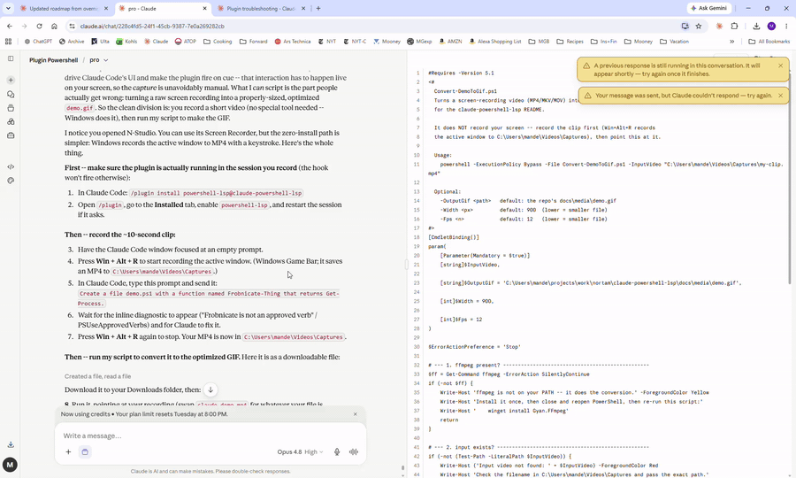

# PowerShell diagnostics for Claude Code

[](https://github.com/manderse21/claude-powershell-lsp/actions/workflows/powershell-lsp-ci.yml)
[](https://github.com/manderse21/claude-powershell-lsp/tags)
[](./LICENSE)
[](./TRUST.md#supply-chain-artifacts-sbom--build-provenance)
[](#diagnostic-correctness-corpus)
[](./TRUST.md#signing-posture)

> **What those attestation badges do NOT cover.** The SBOM, provenance, and Sigstore badges
> attest build integrity over the **source archive** -- they are **not** Windows Authenticode,
> assert **no** verified-publisher identity, and are **not** a third-party security audit. The
> exact boundary is stated in [What this does and does not prove](#verifying-your-install-and-a-release)
> below and in [TRUST.md, "Honest limits"](./TRUST.md#honest-limits).

As Claude edits a `.ps1`, `.psm1`, or `.psd1`, this plugin runs real PowerShell Editor Services
(PSES) + PSScriptAnalyzer over that file and feeds the result -- syntax errors and lint findings,
with fix suggestions -- straight back into Claude's context, so a mistake gets caught and
corrected in the same turn. It is language tooling, not project tooling.
No recurring prompt injection; context is added only when a PowerShell edit produces diagnostics or enabled guidance.
A language server spawns only when a PowerShell file is edited, and one warm process serves the
whole session, so each edit pays a fast pipe round-trip instead of a cold start.



**Install and verify in about five minutes** -- install to a real caught diagnostic, including the
first-session bootstrap you cannot skip. Requires `pwsh` (PowerShell 7+) on your PATH
(`winget install Microsoft.PowerShell` if it is missing); then:

```text
# 1. In Claude Code -- add the marketplace, install, then enable the plugin:
/plugin marketplace add manderse21/claude-powershell-lsp
/plugin install powershell-lsp@claude-powershell-lsp
/plugin enable powershell-lsp

# 2. Start a new session (or /reload-plugins) so the hooks load and the first
#    SessionStart bootstraps PSES + the warm daemon.

# 3. Confirm it is healthy BEFORE you rely on it -- run the preflight DOCTOR from
#    inside the enabled session (so it can see the plugin data dir):
/powershell-lsp:doctor
#    All PASS (benign UNKNOWNs are fine) -> ready. A FAIL names the exact fix.
```

**See it catch something.** Ask Claude to write:

```powershell
function Frobnicate-Thing { Get-Process }
```

and the PostToolUse hook returns, right in Claude's context:

> The cmdlet 'Frobnicate-Thing' uses an unapproved verb. (PSUseApprovedVerbs)

Claude sees its own mistake and corrects it without you switching tools. Full prerequisites and
the step-by-step walkthrough are in [Quick start](#quick-start).

## What you get

Three capabilities, in the order most users meet them.

### 1. Live edit diagnostics (on by default)

The core loop above, live on every supported host today: each PowerShell edit is analyzed by a
warm PSES + PSScriptAnalyzer and the findings return in the same turn, deduped, ordered, and
filtered by your [configuration](#configuration). Nothing else needs enabling.

**What the live surface covers, and what it does not.** Diagnostics are delivered through a
**PostToolUse hook**, so the analyzed set is exactly *the files Claude edits in this session* --
one file per edit, as it is edited. There is no file watcher and no background sweep of files
nobody touched, which is what keeps the always-on cost at zero.
Automatic live workspace analysis remains on the roadmap. Explicit whole-repository scanning is available today through lsp-scan.ps1 and CI/SARIF integration.
See [Repository and CI validation](#3-repository-and-ci-validation-opt-in) below for that path.

### 2. Native code navigation (opt-in)

Set [`nativeServe`](docs/configuration.md#nativeserve) to `shim` and hover, go-to-definition,
find-references, and documentSymbol serve to Claude Code's **native** LSP client on a `.ps1` /
`.psm1` / `.psd1` -- resolved through PSES, not just the diagnostics from the warm hook.

It is **off by default** because it is a workaround: Claude Code's LSP client currently rejects
the standard server-to-client requests PSES sends during initialization (the upstream
`#1359`-class handshake gap), so a thin stdio proxy closes the gap locally. `off` is a byte-exact
transparent pass-through, and the diagnostics hook is wholly independent of this knob. Mechanics,
the removal path, and the **Windows Claude Code 2.1.196-2.1.200 known issue** are in
[docs/configuration.md, `nativeServe`](docs/configuration.md#nativeserve) and
[Why a hook, not native registration](#why-a-hook-not-native-lspjson-registration).

### 3. Repository and CI validation (opt-in)

The same diagnostics engine is also a standalone gate. `scripts/lsp-scan.ps1` runs over a path --
one file or a whole directory -- and emits **SARIF 2.1.0** for GitHub code scanning, or a
human-readable text report.

```powershell
# Scan a directory, emit SARIF for code scanning (the default format):
pwsh -File scripts/lsp-scan.ps1 ./src -OutputPath results.sarif

# Scan a single file, human-readable text:
pwsh -File scripts/lsp-scan.ps1 ./build.ps1 -Format text

# Fail the build (exit 2) if any warning-or-worse finding is present:
pwsh -File scripts/lsp-scan.ps1 ./src -Format text -FailOn warning
```

**One engine, in-agent and in-CI.** The scan is a *sibling* invocation of the exact path the
PostToolUse hook uses -- same warm daemon, same `scripts/lsp-client.ps1`, same pinned
SHA-256-verified analyzer -- so a finding is identical whether it surfaces while Claude edits or
in your CI. A test (`tests/PowerShellLsp.SarifScan.Tests.ps1`) runs the whole correctness corpus
through the scan entry point and asserts its findings match the in-agent snapshots exactly.

Only `.ps1` / `.psm1` / `.psd1` are scanned; a directory recurses by default (`-NoRecurse` limits
to the top level). Severity maps honestly to SARIF's four levels (Error -> `error`, Warning ->
`warning`, Information and Hint -> `note`; nothing maps to `none`, and an unknown severity maps to
`warning` so a finding is never silently dropped). Exit codes: `0` completed, `2` `-FailOn`
threshold met, `3` usage error, `4` scan incomplete (an unanalyzed file is never reported clean).

**This repository scans itself.** `.github/workflows/powershell-lsp-code-scanning.yml` uploads
SARIF to GitHub code scanning on every push to `main`, weekly, and on demand -- a separate
workflow from the CI legs, so it can never turn a merge gate red. Copy it as a starting point;
two details are deliberate: it scans `scripts/` rather than the repo root (because
`tests/corpus/samples/` is deliberately-bad code), and it pins `upload-sarif` by **commit SHA**,
not by tag.

### Commands

Three slash commands, available once the plugin is enabled. Each **wraps a script that already
ships** -- they add no analysis of their own:

| Command | What it does |
|---|---|
| `/powershell-lsp:doctor` | The full preflight health check with a named fix for anything wrong (`scripts/doctor.ps1`). Report-only. |
| `/powershell-lsp:status` | The same checks rendered as one line each -- a health glance rather than a fix-list (`scripts/doctor.ps1 -Summary`). |
| `/powershell-lsp:scan <path>` | Scans a file or directory with the same engine the edit hook uses (`scripts/lsp-scan.ps1`). This is the explicit whole-repository path. |

`status` runs the identical checks as `doctor` and produces the identical statuses and exit code;
only the presentation differs.

## Prerequisites

Checked in order by the [Quick start](#quick-start) below.

- [ ] **PowerShell 7+ (`pwsh`) on your PATH.** As of 1.1.1 the plugin's hooks launch under
  `pwsh`; Windows PowerShell 5.1 alone cannot bootstrap them. Check with `pwsh -v`.
- [ ] **Internet access on the first enabled session -- or a configured offline source.** PSES and
  PSScriptAnalyzer are downloaded on first use, not vendored (see
  [Pinned versions](#pinned-versions)). The download is idempotent and marker-gated. On a machine
  with no egress, point the plugin at an internal mirror or a pre-staged bundle instead --
  see [Offline and air-gapped installation](docs/configuration.md#offline-and-air-gapped-installation);
  every source is verified against the same SHA-256 pin. With neither configured and no internet,
  the first run surfaces an honest `unavailable` banner instead of failing silently (see
  [Diagnostics status](#diagnostics-status)).
- [ ] **On managed / locked-down Windows,** a security control (WDAC / AppLocker / ExecutionPolicy
  / Constrained Language Mode) can block a downloaded component; it then reads as `unavailable`
  rather than crashing. See [Troubleshooting](#troubleshooting).

Windows PowerShell 5.1 can still serve as the PSES *child host* (set `ps_host` to `powershell`);
it simply cannot launch the hooks themselves. See [Platform support](#platform-support).

## Quick start

The three-step block at the top of this README is the whole job -- from install to a real caught
diagnostic. A few of its steps are deliberate, documented here rather than removed:

- **`/plugin enable` stays an explicit step.** The plugin ships disabled by default
  (`defaultEnabled: false`) because it downloads a bundle and spawns a language server, so
  enabling it is a conscious opt-in.
- **The new session / reload is required** -- Claude Code loads plugin hooks at session start, so
  enabling alone does not load them.
- **The first enabled session does the rest itself.** Its `SessionStart` hook downloads PSES and
  vendors PSScriptAnalyzer (both idempotent and marker-gated), then launches one warm daemon for
  the session. The first edit may briefly read `incomplete` while PSES finishes starting, then
  settles on the next edit (see [Diagnostics status](#diagnostics-status)).
- **Run the doctor (step 3).** `/powershell-lsp:doctor` is the in-session form and needs no paths;
  the raw `scripts/doctor.ps1` invocation under [Troubleshooting](#troubleshooting) is for the
  out-of-session case, where the slash command is not available. It turns the worst onboarding
  failure -- enabled but a prerequisite is missing, so diagnostics silently do nothing -- into a
  named, actionable fix-list, and it confirms the warm daemon is actually answering before you
  trust a silent result as "analyzed, clean". It is **report-only**: it never downloads, repairs,
  or starts anything. See [the preflight doctor](#troubleshooting).

## Configuration

Set these via the `/plugin` config UI for `powershell-lsp`, or leave the defaults. Every default
is safe: no knob has to be set for the live diagnostics loop to work.

**[docs/configuration.md](docs/configuration.md) is the authoritative reference** -- every knob's
allowed values, precedence, guards, and edge cases, one anchored section per knob. The config
panel and the tables below are summaries of it.

**Start with one setting, not twenty.** The `profile` knob is a curated preset over every other
knob. Pick the row that matches how much you want surfaced -- the middle column is the value you
type into the config panel:

| Profile | Value | What you get |
|---------|-------|--------------|
| Compatibility | `safe` (default) | Exactly today's shipped defaults. `safe` maps **nothing** rather than restating the defaults, so the diagnostics surface is byte-for-byte unchanged. Start here. |
| Recommended | `recommended` | A broader but still quiet surface: the `base` ruleset, formatter and module hints as **suggestions**, reference-count facts, and two lines of edit context. Nothing writes to your files. |
| Comprehensive | `strict` | `recommended` plus an audit posture: whole-file scope, no per-file cap, and longer log retention -- so a finding is never hidden by scoping or truncation. |

**Three ways to configure, in one sentence each.** Leave everything alone and you get
Compatibility (`safe`), which is byte-for-byte today's behavior. Set `profile` to `recommended` or
`strict` for a curated preset. Or go **custom**: set knobs yourself -- an explicitly-set knob always
wins, whether or not a profile is also set. "Custom" is not a `profile` value, it is what you get by
setting a knob, which is why there is no fourth mechanism.

**Every knob.** The full surface -- `profile` first, then the nineteen knobs it presets:

| Key                | Default  | Meaning                                                                              |
|--------------------|----------|--------------------------------------------------------------------------------------|
| `profile`          | `safe`   | The preset chooser above: `safe` = Compatibility, `recommended` = Recommended, `strict` = Comprehensive. **A knob you set explicitly always wins over the profile.** See [profile](docs/configuration.md#profile) |
| `ps_host`          | `pwsh`   | PSES host executable: `pwsh` (PowerShell 7+, recommended/tested) or `powershell` (Win 5.1) |
| `severityThreshold`| `Hint`   | Least-severe level to report: `Error` > `Warning` > `Information` > `Hint`            |
| `ruleInclude`      | _(empty)_| Comma-separated PSScriptAnalyzer rule codes to report exclusively; empty = all        |
| `ruleExclude`      | _(empty)_| Comma-separated rule codes to suppress (e.g. `PSAvoidUsingWriteHost`)                  |
| `timeoutMs`        | `5000`   | Total hard cap (ms) before the PostToolUse client degrades to log-only                 |
| `debounceMs`       | `150`    | Edits landing within this window (ms) fold into one analysis pass                      |
| `keepLastN`        | `10`     | Newest rolling log files kept per family (swept at SessionStart)                       |
| `idleTtlMin`       | `30`     | Daemon self-terminates after this many minutes with no diagnostics request            |
| `perFileCap`       | `20`     | Max diagnostics reported per file; the rest collapse into an `... and N more` line; `0` = no cap |
| `enableStats`      | `false`  | Append one JSONL timing line per analyzed edit to `logs/stats.jsonl`; observe-only, never changes output. Logs an absolute path per line -- see [the privacy note](docs/configuration.md#enablestats) |
| `settingsPath`     | _(empty)_| Absolute path to a `PSScriptAnalyzerSettings.psd1` to honor, overriding auto-discovery; a relative value is ignored |
| `scopeToEdit`      | `true`   | Scope surfaced diagnostics to the lines the edit touched (plus `editContextLines`); fails open to whole-file when the range is indeterminate |
| `editContextLines` | `0`      | Extra context lines kept above and below the touched range when `scopeToEdit` is on    |
| `formatOnEdit`     | `off`    | `suggest` surfaces a formatter diff and **never rewrites your file**; `apply` additionally writes it back behind a stale-write / atomic / byte-fidelity guard and is doubly opt-in. Values: `off`, `suggest`, `apply`. See [formatOnEdit](docs/configuration.md#formatonedit) |
| `ruleset`          | `pses-default` | Live diagnostics ruleset tier. `pses-default` keeps PSES's built-in no-settings set (about 15 rules); `base` opts in to the shipped enumerated ruleset so `PSAvoidUsingWriteHost` and the three Error-severity security rules surface. Repo settings always win. See [ruleset](docs/configuration.md#ruleset) |
| `moduleAwareness`  | `off`    | `suggest` adds an **Information** hint when a command is exported by a **known** module that is **not installed** here. Positive-identification only, silent on ambiguity, never writes. See [moduleAwareness](docs/configuration.md#moduleawareness) |
| `nativeServe`      | `off`    | `shim` serves hover / go-to-definition / find-references / documentSymbol to Claude Code's native LSP client through a handshake proxy. `off` is a byte-exact pass-through. See [Native code navigation](#2-native-code-navigation-opt-in) |
| `referenceSurfacing`| `off`   | `counts` surfaces bare per-function facts (cross-file reference counts, where a call is defined) as additive **Information**, never a diagnostic. Silent on ambiguity, never writes. See [referenceSurfacing](docs/configuration.md#referencesurfacing) |
| `orgPolicy`        | _(empty)_| **Absolute** path to a centrally-managed `PSScriptAnalyzerSettings.psd1` whose `ExcludeRules` are enforced above repo-local config -- an org can take a rule **away**, never force one **on**. Fails open. See [orgPolicy](docs/configuration.md#orgpolicy) |

Diagnostics are returned in a stable order (severity, then line, then column), deduped,
threshold- and rule-filtered, then capped per file.

These filters apply on top of whatever **PSES** publishes. By default (`ruleset` =
`pses-default`) PSES runs its own built-in no-settings rule set for live analysis, which is
narrower than the `Invoke-ScriptAnalyzer` CLI default -- for example `PSAvoidUsingWriteHost` is
not surfaced on the fly even though the CLI flags it. The filter knobs (`severityThreshold`,
`ruleInclude`, `ruleExclude`) can *suppress or narrow* what PSES reports. To *broaden* the live
surface instead, set `ruleset` = `base`, or point `settingsPath` at your own settings file.

## Diagnostics status

Every analyzed edit resolves to one of four statuses. The clean case is silent; the other three
surface a one-line banner in Claude's context, so a result is never *mistaken* for "analyzed,
clean" when it was not actually analyzed. The wording is owned in one place
(`Get-DiagnosticsStatusBanner` in `scripts/lib/lsp-common.ps1`).

| Status            | When                                                                 | What you see / what to do |
|-------------------|----------------------------------------------------------------------|---------------------------|
| **`ok`**          | The PSScriptAnalyzer pass settled and the analyzer was available.    | Nothing extra -- diagnostics (if any) are shown, no banner. The warm happy path. |
| **`incomplete`**  | The pass did **not** settle for this edit -- PSES timed out, threw, exited, a supervised re-spawn was mid-flight, or PSES is **still starting**. | `analysis did not complete -- this edit was NOT checked.` Transient: the next edit usually succeeds once PSES is ready. |
| **`degraded`**    | PSES is up and settled, but the vendored **PSScriptAnalyzer is absent**, so only the parser ran. | `parser-only mode -- PSScriptAnalyzer unavailable, lint rules were NOT checked (syntax errors are still reported).` Start a fresh session so `ensure-pssa` re-vendors; see `logs/ensure-pssa.log`. |
| **`unavailable`** | PSES **could not start at all**, for the whole session -- the bundle never bootstrapped (a clean box, offline or behind a proxy), or it is present but failed to initialize. | `PowerShell editor services could not start ... Diagnostics will stay OFF for this whole session until it is fixed and the session is restarted.` Fix the install/startup, then start a fresh session; see `logs/ensure-pses.log` and `logs/pses-daemon.log`. |

`incomplete` (transient) and `unavailable` (permanent for the session) are deliberately distinct,
with distinct remedies. When the daemon is unreachable entirely -- no pipe at all -- the
PostToolUse client surfaces its own honest "analyzer was not reachable -- this edit was NOT
checked" banner, so even the no-pipe case is never silent.

## Performance

Measured on `pwsh` 7.6.3, Windows 11 Pro, at the **v1.24.3** build, on 2026-07-17:
**warm-path latency** (edit -> diagnostic round-trip) has a **median of 2228 ms** and a **p95 of
2463 ms** over **30 iterations**. A figure without its sample size is not evidence, which is why
the n travels with it.

**Cold-start latency is not published here, because it is not currently measured to publication
standard.** The benchmark harness excludes cold start deliberately, so the repository holds no
cold-start measurement to quote. Cold start *is* threshold-guarded in
`tests/PowerShellLsp.Benchmark.Tests.ps1`, but a guard threshold is chosen to be generous and is
not a measurement; publishing it as one would render *not currently measured* as a measurement --
precisely the failure the plugin's own four-state diagnostic model exists to prevent, applied here
to the README. Publishing a cold-start number would require a cold-start path in the harness,
reported with its sample size, host, and build on the same footing as the warm figure above.

A v1.12.0-era note attributed roughly 0.7 s of the warm path to the per-hook `pwsh` process spawn
that Claude Code pays regardless of plugin code. That attribution has **not** been re-measured
against the figures above, so it is recorded with its original vintage rather than restated as
current.

These latencies are **measured and guarded in CI** by a repeatable benchmark harness
(`tests/PowerShellLsp.Benchmark.Tests.ps1`) on all four CI legs, which emits structured results
and fails if a median regresses past a threshold. Full numbers and method:
[docs/benchmarks.md](docs/benchmarks.md).

## How it works (warm-start daemon)

Diagnostics are delivered through a **PostToolUse hook backed by a warm, per-session daemon** --
one PSES stays hot for the whole session, so each edit pays a pipe round-trip instead of a cold
PSES start.

```text
SessionStart  -> scripts/session-start.ps1
                   ensure-pses.ps1   (idempotent PSES bootstrap, pinned tag)
                   ensure-pssa.ps1   (idempotent PSScriptAnalyzer vendor, pinned)
                   log sweep, reap OUR stale daemons (recorded pids only, verified)
                   launch scripts/pses-daemon.ps1  (one warm PSES via -Stdio;
                     named pipe powershell-lsp-<sessionid>)

PostToolUse   -> scripts/lsp-client.ps1
                   read hook JSON (session_id, file_path) from stdin
                   connect to the pipe, request diagnostics for the edited file
                   daemon: didOpen/didChange -> wait for the SETTLED PSScriptAnalyzer
                     publish (not the early parser publish) -> debounce
                   return deduped, severity-sorted diagnostics via additionalContext

SessionEnd    -> scripts/session-end.ps1
                   pipe {shutdown} -> daemon sends LSP shutdown/exit to PSES, exits
```

All scripts run `-NoLogo -NoProfile`, write nothing to stdout on the daemon/LSP path, and keep all
state, logs, and pids under `CLAUDE_PLUGIN_DATA` only. The full flow from edit to banner is in
[ARCHITECTURE.md](./ARCHITECTURE.md).

## Why a hook, not native `.lsp.json` registration

Claude Code declares plugin language servers through an inline `lspServers` block in
`plugin.json`. This plugin carries that block, and as of v1.18.1 the manifest-side blocker that
kept it from registering is removed -- so native **registration** is no longer the obstacle. The
plugin still ships diagnostics over a **warm PostToolUse hook** for one reason: **registration is
restored, but end-to-end serve is not.** Claude Code's LSP client rejects the standard
server-to-client requests PSES sends during initialization (the `#1359`-class handshake), so on
the **direct** path init times out and native nav does not serve -- gated upstream, not on this
plugin's launcher. The opt-in [`nativeServe = shim`](#2-native-code-navigation-opt-in) closes that
gap locally.

The full history -- the marketplace packaging gap, the registration race, and the two manifest
fields (`restartOnCrash`, `shutdownTimeout`) that Claude Code's registrar silently drops (now
CI-guarded) -- plus the 23-probe methodology matrix and the standalone
[`docs/lsp.json.template`](docs/lsp.json.template), are in
[`docs/upstream/claude-code-lsp-registration.md`](docs/upstream/claude-code-lsp-registration.md).

> **Heads-up for when serve lands -- duplicate diagnostics.** If native serving ever completes
> (the upstream init handshake is fixed) while the PostToolUse hook is also enabled, each
> diagnostic could arrive twice. Use one path or the other.

## Pinned versions

| Component         | Version  | Pinned in                 | Source                                  |
|-------------------|----------|---------------------------|-----------------------------------------|
| PSES              | `v4.6.0` | `scripts/ensure-pses.ps1` (`$PsesTag`)     | GitHub release `PowerShellEditorServices.zip` |
| PSScriptAnalyzer  | `1.25.0` | `scripts/ensure-pssa.ps1` (`$PssaVersion`) | PowerShell Gallery                      |

To bump either, change the single pin variable named above and start a fresh session (the
ensure-step re-vendors at the new version, keyed by a per-version marker). See
[CHANGELOG](./CHANGELOG.md#versioning) for how a bump maps to SemVer.

In CI the pinned PSScriptAnalyzer `.nupkg` is cached (keyed by the pinned version **and**
SHA-256), but the integrity pin stays load-bearing on every path: a restored `.nupkg` runs through
the same SHA-256 verification as a fresh download, and a poisoned or stale entry fails closed. The
cache is a transport optimization, never a trust shortcut.

## Platform support

As of 1.1.1 the **hooks require `pwsh` (PowerShell 7)**. Windows PowerShell 5.1 is supported as
the **PSES child host** (set `ps_host` to `powershell`), not as the hook interpreter.

CI runs the Pester suite on a four-leg matrix: **Windows `pwsh` 7**, **Windows PowerShell 5.1**,
**Ubuntu `pwsh`**, and (as of 1.3.0) **macOS `pwsh`**. The full warm-daemon **integration suite**
runs and is **green on all four legs**, so the Linux and macOS daemon paths are CI-verified, not
merely authored. The 5.1 leg's distinct value is exercising the **shared-library surface under
5.1** -- file-URI casing, BOM-tolerant stdin, the `ArgumentList`-vs-quoted-`.Arguments` split, and
the config-env fallback. The scripts are cross-platform: paths go through `Join-Path`, the single
Windows-only call is guarded behind `Test-OnWindows` with Linux `/proc` and macOS `ps` fallbacks,
and the transport is `System.IO.Pipes`.

## Diagnostic-correctness corpus

A curated corpus (`tests/corpus/`) proves the diagnostics the tool *reports* are correct -- not
merely present, and not merely honest when it cannot analyze. Three sample categories carry the
headline: **clean** (50 cases, expect zero findings), **known-bad** (36 cases, six per surfaced
rule, asserting the exact rule id, line, and severity), and **parser-error** (3 cases).

**Which fixtures the headline scores.** `Get-CorpusCorrectnessReport`
(`tests/corpus/Corpus.Common.ps1`) builds the false-positive denominator from every `clean` spec
and the true-positive denominator from every `bad` spec, as enumerated by `Get-CorpusSampleSpec`:
`samples/clean` contributes both its `*.ps1` and its `*.txt` fixtures, `samples/bad` its `*.ps1`
fixtures. The corpus also carries `bashism`, `compat`, `pre-pssa` and `module` fixtures, each
separately asserted; **none of them enters either headline denominator.** The denominators below
are therefore the full scored sets, not a subset.

**Measured correctness (default config, all four CI legs):** a **0% false-positive rate** (0 of 50
known-good cases produced any finding) and **100% true-positive coverage** (36 of 36 known-bad
cases surfaced their expected rule). These numbers are not prose -- they are recomputed from the
live tool on every CI run and **guarded** (`tests/PowerShellLsp.Corpus.Tests.ps1` fails CI if the
false-positive rate rises above zero or coverage drops below 100%, and separately **floors** each
scored set at **30 fixtures**, so a rate cannot be made defensible by shrinking the oracle), with
the per-run report uploaded as a CI artifact. That floor is a floor, **not a ratchet**: it does
not pin the corpus at its present size, so a deliberate withdrawal -- as in v1.29.0 -- stays green
while it stays above the floor. The claim is *measured and defensible*, not *exhaustive*.

**The invariant that makes it trustworthy:** every expected finding is *derived* by running the
REAL tool over the sample and snapshotting exactly what it emits -- never hand-authored, never
model-authored. A hand-edited snapshot cannot make the test pass; it would simply disagree with
the real tool.

One fact the corpus surfaced: the tool's effective default ruleset (via PSES) is **narrower** than
raw PSScriptAnalyzer -- it surfaces **six** rules on the fly and drops others the CLI flags (e.g.
`PSAvoidUsingWriteHost`, `PSUseSingularNouns`). Set `ruleset` = `base` to broaden it.

Every diagnostic surfaced is also teed to a local, append-only **dogfood log** so real editing
drives the roadmap's quality work; capture, the offline review tool, and the never-commit rules
are in [docs/dogfood.md](docs/dogfood.md).

## Troubleshooting

**Start with the preflight doctor.** It checks prerequisites and bootstrap health in one place and
prints a named fix-list. Inside an enabled session use the slash command; the raw script is the
form that still works **outside** a session, where the slash command does not exist:

```
/powershell-lsp:doctor          # inside an enabled Claude Code session
pwsh -File scripts/doctor.ps1   # out-of-session (several checks then report UNKNOWN)
```

It verifies, in order: PowerShell 7 (`pwsh`) is present and new enough; the plugin is enabled; the
PSES bundle and PSScriptAnalyzer finished bootstrapping; the first-run download hosts are
reachable; the **warm per-session daemon** is alive and answering on its named pipe; **which rule
set is actually active** here and which config layer won it; whether a **real diagnostic is
observed end-to-end**; and whether **native navigation** is on. Each check reports `PASS`, a
specific failure with the fix, or an honest `UNKNOWN` when it genuinely cannot determine (run
outside a Claude Code session it cannot see the plugin data directory, so several checks report
`UNKNOWN`; run it from inside an enabled session for a definitive result).

The last three answer questions the others structurally cannot. The daemon check's liveness ping is
answered *without* touching the language server, so a daemon can be alive, answering, and analyzing
nothing -- the **end-to-end check** closes that by sending a synthetic file with a deliberate defect
through the same warm daemon your edits use and requiring the expected finding back. It is the one
check that can report a `FAIL` for a *settled* analysis that produced nothing, because "analyzed,
clean" when nothing was analyzed is the failure this plugin exists to prevent. The probe writes only
to a temp directory, never starts a daemon, and leaves nothing behind. The **active ruleset** check
explains the most common confusion -- you set `ruleset = base`, see nothing new, and a repo-local
`PSScriptAnalyzerSettings.psd1` was legitimately winning all along.

The daemon check **observes only** -- it never starts, restarts, or kills the daemon -- and it is
honest about the auto-relaunch design: **no daemon running** reports `PASS` (one auto-relaunches
on your next edit), while a daemon that is alive but parked `unavailable` / `degraded`, or alive
but not answering its pipe, is a `FAIL` with the restart remedy. The doctor is **report-only**: it
never downloads, repairs, runs the bootstrap, or starts/restarts anything.

**Common symptoms** -- `'pwsh' is not recognized`, a leftover user-level PSES hook doubling up,
`Executable not found in $PATH` in the `/plugin` Errors tab, no diagnostics at all, a failing
handshake, and the PSES `v4.6.0` `PrepareRenameHandler` NRE -- are each diagnosed with their fix in
[docs/troubleshooting.md](docs/troubleshooting.md).

**Security-control blocks on managed Windows.** This plugin does exactly what locked-down estates
gate: it downloads executables, runs PowerShell, and spawns a daemon. When a control blocks one at
first start, the SessionStart banner **names the most likely control and the legitimate
remediation** -- on positive evidence only, with calibrated confidence, never a guessed control.
The detection table (ExecutionPolicy, Constrained Language Mode, WDAC, Defender ASR, Smart App
Control) and the commands to investigate are in
[docs/troubleshooting.md](docs/troubleshooting.md#security-control-blocks-on-managed-windows).
**The plugin only ever detects and explains a block -- it never bypasses, disables, or modifies a
security control.**

## Verifying your install and a release

You do not have to take this plugin's integrity on trust. The two pinned dependencies it downloads
on first run are each verified against a SHA-256 computed from the real known-good artifact
*before* use, and a mismatch **fails closed**. The pins live in `scripts/ensure-pses.ps1`
(`$PsesTag` / `$PsesSha256`) and `scripts/ensure-pssa.ps1` (`$PssaVersion` / `$PssaSha256`); the
hash table is in [TRUST.md](./TRUST.md).

Every tagged release is built by this repository's gated release pipeline, which publishes a
**SLSA v1.0 build-provenance attestation** over the release archive and a **keyless gitsign
(Sigstore) signature on the release tag** -- both through GitHub's OIDC identity, with **no
maintainer-held key** in the trust path:

```
gh release download v1.17.0 --repo manderse21/claude-powershell-lsp --pattern "*.tar.gz"
gh attestation verify powershell-lsp-1.17.0.tar.gz --repo manderse21/claude-powershell-lsp
```

**What this does and does not prove.** This is build provenance and integrity over the downloadable
**source archive** -- it proves the release came untampered from this repository's pipeline. It is
**not** Windows Authenticode and does **not** assert a Windows verified-publisher identity (no
SmartScreen reputation, no signed-script trust); Authenticode signing is deliberately not pursued
for a git-distributed plugin. That is the correct boundary here: the integrity of the normal
`/plugin` install path rests on the **git commit and the keyless-signed tag** themselves, not on
the archive. The step-by-step walkthrough (including verifying the tag with `gitsign`, with sample
output) is in [SECURITY.md](./SECURITY.md#verifying-release-integrity), and exactly what the
provenance covers is in
[docs/RELEASING.md](docs/RELEASING.md#provenance-what-it-covers-and-what-it-does-not).

### What version am I on, and how far back is my data attributable?

The two facts a support thread opens with, and both are printed by the commands you already run for
health -- as **header lines above the check table**, so they are there even when every check below
them is UNKNOWN:

```
powershell-lsp doctor -- preflight self-check (report-only)
  version: 1.30.0
  provenance floor: v1.29.0  (earliest version-attributable release in the RETAINED lifecycle window; 41 attributable, 12 pre-floor)
```

`/powershell-lsp:doctor` and `/powershell-lsp:status` print both lines, identically. Neither is a
check: they contribute nothing to the `of N checks` count and cannot move the exit code.

- **version** is the plugin manifest's version, read at run time -- not a build string and not a
  guess. It is the same value the plugin stamps into every lifecycle record it writes.
- **provenance floor** is the earliest release the plugin's own clearance data can be attributed
  to. It is **window-relative**: the lifecycle log is a rolling family trimmed to the `keepLastN`
  newest files, so the floor names the earliest attributable release among the records **still
  retained**, and it *rises* as older records age out. It is an honesty marker, never a filter --
  records below it are still counted in every rate, simply never attributed to a release.

The other renderings are honest answers rather than a fabricated floor: `(none)` when records exist
but none carries a usable version; `(absent)` when no lifecycle log has been written yet, or when
one exists but holds no record; and `(undetermined)` when the search ran under a fallback data root,
where "nothing was ever captured" and "this run could not find it" cannot be told apart.

**The command output is the live answer -- prefer it to this page.** Each figure has exactly one
source (`Get-PluginVersion` and `Get-LifecycleProvenanceFloor`), and the `clearance provenance
floor` that `scripts/rule-efficacy-ledger.ps1` prints comes from that same function, so the
readout, the ledger and this section cannot disagree. The numbers above are illustrative; yours
come from your install.

## Security and trust

Evaluating this plugin for a managed or locked-down Windows estate? **[TRUST.md](./TRUST.md)** is
the approve-or-deny reference: what runs locally and what never leaves the machine (no network
service, no telemetry), the pinned + SHA-256-verified downloads, the CycloneDX SBOM and build
provenance, the **signing posture**, paste-ready WDAC / AppLocker allow-list rules, and the
governance / bus-factor posture. **[docs/trust.md](docs/trust.md)** assembles the verifiable chain
in one place, every claim linked to a file in this repository or an artifact on the Release.

Found a vulnerability? See **[SECURITY.md](./SECURITY.md)** -- report it privately via GitHub
private vulnerability reporting (never a public issue).

## Releasing

Releases are cut by a **maintainer-triggered, gate-validated pipeline** -- never automatically on
push or merge. It refuses to tag unless the target commit is merged to `main`, green on every CI
leg, and version-matched, then cuts the keyless gitsign-signed tag and publishes a GitHub Release
with CHANGELOG-sourced notes, an SBOM, and a provenance attestation. See
[docs/RELEASING.md](docs/RELEASING.md).

## Contributing and development

Contributions are welcome. Start with **[CONTRIBUTING.md](./CONTRIBUTING.md)** (prerequisites, how
to run the suite, the test story), **[ARCHITECTURE.md](./ARCHITECTURE.md)** (how a diagnostic flows
from edit to banner), and **[DEV_NOTES.md](./DEV_NOTES.md)** (the quirks that bite). What is next,
blocked, and deferred is in **[ROADMAP.md](./ROADMAP.md)**. Found a false positive? The
[report-a-false-positive form](./.github/ISSUE_TEMPLATE/false_positive_report.yml) feeds it
straight into the correctness corpus. The single-maintainer bus factor and the open-source fork
path are stated honestly in **[CONTINUITY.md](./CONTINUITY.md)**.

**Git hooks (contributors).** This repo ships a tracked pre-push guard that refuses a direct push
to `origin/main` -- main lands via a reviewed, merged PR, never a local push. Enable it once per
clone with `pwsh -File scripts/install-git-hooks.ps1`; it sets `core.hooksPath`, so the guard fires
from linked worktrees too. A deliberate one-off is allowed and audited:
`POWERSHELL_LSP_ALLOW_PUSH_TO_MAIN="<reason>" git push ...`. See
[CONTRIBUTING.md](./CONTRIBUTING.md#git-hooks).

## License

[Apache-2.0](https://spdx.org/licenses/Apache-2.0.html). See [LICENSE](./LICENSE) and
[NOTICE](./NOTICE).

The change to Apache-2.0 is **forward-only**, effective from the next release. **Every previously
published release keeps the license it shipped under, and those grants are irrevocable:** v1.0
through v1.6.0 remain MIT; v1.6.1 through the current release remain `GPL-3.0-or-later`. Nothing
here revokes, rescinds, or diminishes a grant already made -- if you are using a release published
before this change, your existing license is untouched.

Apache-2.0 is a **permissive** license, not copyleft. It adds an explicit patent grant and the
NOTICE-propagation mechanics that enterprise license allow-lists are written around; it does not
require a downstream fork to publish its changes, which GPLv3 did. See
[CONTINUITY.md](./CONTINUITY.md#the-fork-path-apache-20) for what that means for the fork path.

PowerShell Editor Services and PSScriptAnalyzer are **downloaded at install time** (not bundled in
this repository) and remain under their own MIT licenses (Microsoft); MIT is Apache-2.0-compatible.
See [THIRD-PARTY-LICENSES.md](./THIRD-PARTY-LICENSES.md).
